# Arquitectura de Akbal Pi

Mapa de las piezas principales y cómo se hablan. El diagrama se dibuja con
Mermaid y GitHub lo renderiza; cada nodo enlaza al archivo fuente.

> **Mantener al día:** cuando se agrega, quita o cambia un módulo o un
> flujo entre piezas, actualiza este diagrama en el mismo cambio (ver
> `AGENTS.md`). Un nodo nuevo sin enlace a su archivo no se acepta.

```mermaid
flowchart TD

subgraph group_interaction["Interacción y dispositivo"]
  node_button["Botón y audio<br/>[audio.ts]"]
  node_flow["Flujo conversacional<br/>[ChatFlow.ts]"]
  node_modes["Modos y comandos<br/>[stateMachine.ts]"]
  node_speaker["Salida de audio<br/>[audio.ts]"]
  node_display["Pantalla Whisplay<br/>[display.ts]"]
  node_displayui["Vista de pantalla<br/>[app.js]"]
  node_memory["Arbitraje de memoria<br/>[memory-arbiter.ts]"]
  node_webmode["Modo chat web en la Pi<br/>[web-chat-mode.ts]"]
  node_wifisaved["Conectar a wifi (redes guardadas)<br/>[wifi-saved-mode.ts]"]
end

subgraph group_ai["IA y conocimiento"]
  node_speech["Reconocimiento de voz<br/>[server.ts]"]
  node_llm["LLM y herramientas<br/>[llm.ts]"]
  node_plugins["Proveedores IA<br/>[registry.ts]"]
  node_knowledge[("Conocimiento y vectores<br/>[knowledge.ts]")]
  node_tts["Síntesis de voz<br/>[server.ts]"]
  node_clips["Clips de voz del chat<br/>[piper-clips.ts]"]
end

subgraph group_web["Administración web"]
  node_admin["Interfaz web<br/>[app.js]"]
  node_webserver["Servidor web"]
  node_wifi["WiFi y redes<br/>[wifi.ts]"]
  node_storage["Archivos y USB<br/>[storage.ts]"]
  node_chats["Historial de chats<br/>[store.ts]"]
  node_commands["Comandos del chat<br/>[registry-core.ts]"]
end

subgraph group_radio["Radio y ubicación"]
  node_radar["Radar WiFi<br/>[service.ts]"]
  node_wardrive["Wardriving<br/>[service.ts]"]
  node_audit["Auditoría WiFi<br/>[service.ts]"]
  node_aircraft["Radar ADS-B<br/>[service.ts]"]
  node_radioplan["Modos de radios de Wardrive<br/>[radio-plan.ts]"]
  node_akbal["Paquetes .akbal (compartir sesiones)<br/>[package.ts]"]
end

subgraph group_doom["DOOM"]
  node_doommode["Modo DOOM en pantalla<br/>[doom-mode.ts]"]
  node_doomsession["Sesión del motor<br/>[session.ts]"]
  node_doomroutes["Ruta WebSocket de DOOM<br/>[doom-routes.ts]"]
  node_doompage["Página de control<br/>[doom.js]"]
  node_doomowner["Dueño del juego (Pi o web)<br/>[session.ts]"]
  node_doomaudio["Salida de audio de DOOM<br/>[audio-out.ts]"]
  node_doommusic["Música MIDI de DOOM<br/>[music.ts]"]
  node_doomwad["WAD de DOOM (Doom1.WAD)<br/>[wad.ts]"]
end

subgraph group_services["Servicios del dispositivo"]
  node_gps["Posición GPS<br/>[gps.ts]"]
  node_music["Reproductor musical<br/>[music-player.ts]"]
end

node_person(("Usuario"))
node_externalai{{"Servicios de IA externos"}}
node_radiohardware{{"Adaptadores y HackRF"}}

node_person -->|"pulsa y habla"| node_button
node_button -->|"entrega audio"| node_flow
node_flow -->|"solicita transcripción"| node_speech
node_speech -->|"devuelve texto"| node_flow
node_flow -->|"consulta modo"| node_modes
node_flow -->|"pide permiso de memoria"| node_memory
node_flow -->|"solicita respuesta"| node_llm
node_llm -->|"activa proveedor"| node_plugins
node_llm -->|"consulta conocimiento"| node_knowledge
node_llm -.->|"invoca proveedor"| node_externalai
node_flow -->|"solicita voz"| node_tts
node_tts -->|"entrega audio"| node_speaker
node_flow -->|"actualiza estado"| node_display
node_display -->|"sirve vista"| node_displayui
node_person -->|"usa interfaz"| node_admin
node_admin -->|"solicita API"| node_webserver
node_webserver -->|"gestiona redes"| node_wifi
node_webserver -->|"gestiona archivos"| node_storage
node_webserver -->|"guarda conversaciones"| node_chats
node_webserver -->|"ejecuta comandos"| node_commands
node_commands -->|"lee datos"| node_radar
node_commands -->|"lee tráfico"| node_aircraft
node_webserver -->|"pide memoria"| node_memory
node_webserver -->|"genera voz del chat"| node_clips
node_clips -->|"sintetiza"| node_tts
node_webserver -->|"consulta radar"| node_radar
node_webserver -->|"gestiona sesiones"| node_wardrive
node_webserver -->|"ejecuta auditoría"| node_audit
node_webserver -->|"consulta tráfico"| node_aircraft
node_radar -->|"captura señales"| node_radiohardware
node_wardrive -->|"captura redes"| node_radiohardware
node_aircraft -->|"recibe ADS-B"| node_radiohardware
node_aircraft -->|"usa posición"| node_gps
node_admin -->|"controla música"| node_music
node_admin -->|"activa modo chat"| node_webmode
node_webmode -->|"congela pantalla"| node_display
node_flow -->|"entra o sale de DOOM"| node_doommode
node_doommode -->|"arranca y detiene el motor"| node_doomsession
node_doomsession -->|"elige el WAD del juego"| node_doomwad
node_doommode -->|"envía cuadros"| node_display
node_doomroutes -->|"reparte cuadros y estado"| node_doomsession
node_webserver -->|"monta /ws/doom"| node_doomroutes
node_webserver -->|"sirve /doom"| node_doompage
node_person -->|"controla desde el celular"| node_doompage
node_doompage -->|"claim, teclas y video"| node_doomroutes
node_doompage -->|"Jugar aquí y volumen"| node_doomowner
node_doomroutes -->|"valida dueño y espejo"| node_doomowner
node_doomowner -->|"arranca o detiene el motor"| node_doomsession
node_doomsession -->|"PCM de efectos"| node_doomaudio
node_doomsession -->|"comandos de música"| node_doommusic
node_doommusic -->|"reproduce MIDI con fluidsynth"| node_speaker
node_doomaudio -->|"aplay a la tarjeta del HAT"| node_speaker
node_flow -->|"pausa el sonido de DOOM mientras Akbal habla"| node_doomsession
node_flow -->|"menú: conectar a wifi"| node_wifisaved
node_wifisaved -->|"conecta con el perfil guardado"| node_wifi
node_flow -->|"enciende el radar al abrir su pantalla"| node_radar
node_wardrive -->|"elige cuántas radios usar"| node_radioplan
node_wardrive -.->|"bloquea el radar mientras corre"| node_radar
node_webserver -->|"exporta e importa sesiones"| node_akbal
node_akbal -->|"lee y guarda sesiones"| node_wardrive

click node_button "https://github.com/mrebola/akbal-pi/blob/main/app/src/device/audio.ts"
click node_flow "https://github.com/mrebola/akbal-pi/blob/main/app/src/core/ChatFlow.ts"
click node_modes "https://github.com/mrebola/akbal-pi/blob/main/app/src/core/chat-flow/stateMachine.ts"
click node_memory "https://github.com/mrebola/akbal-pi/blob/main/app/src/memory/memory-arbiter.ts"
click node_speech "https://github.com/mrebola/akbal-pi/blob/main/app/src/cloud-api/server.ts"
click node_llm "https://github.com/mrebola/akbal-pi/blob/main/app/src/cloud-api/llm.ts"
click node_plugins "https://github.com/mrebola/akbal-pi/blob/main/app/src/plugin/registry.ts"
click node_knowledge "https://github.com/mrebola/akbal-pi/blob/main/app/src/cloud-api/knowledge.ts"
click node_tts "https://github.com/mrebola/akbal-pi/blob/main/app/src/cloud-api/server.ts"
click node_clips "https://github.com/mrebola/akbal-pi/blob/main/app/src/voice/piper-clips.ts"
click node_speaker "https://github.com/mrebola/akbal-pi/blob/main/app/src/device/audio.ts"
click node_display "https://github.com/mrebola/akbal-pi/blob/main/app/src/device/display.ts"
click node_displayui "https://github.com/mrebola/akbal-pi/blob/main/app/web/whisplay-display/app.js"
click node_admin "https://github.com/mrebola/akbal-pi/blob/main/app/web/admin/app.js"
click node_webmode "https://github.com/mrebola/akbal-pi/blob/main/app/src/core/chat-flow/web-chat-mode.ts"
click node_webserver "https://github.com/mrebola/akbal-pi/blob/main/app/src/device/web-admin-server.ts"
click node_wifi "https://github.com/mrebola/akbal-pi/blob/main/app/src/utils/wifi.ts"
click node_storage "https://github.com/mrebola/akbal-pi/blob/main/app/src/utils/storage.ts"
click node_chats "https://github.com/mrebola/akbal-pi/blob/main/app/src/chat-history/store.ts"
click node_commands "https://github.com/mrebola/akbal-pi/blob/main/app/src/chat-commands/registry-core.ts"
click node_radar "https://github.com/mrebola/akbal-pi/blob/main/app/src/wifiradar/service.ts"
click node_wardrive "https://github.com/mrebola/akbal-pi/blob/main/app/src/wardrive/service.ts"
click node_audit "https://github.com/mrebola/akbal-pi/blob/main/app/src/wifi-audit/service.ts"
click node_aircraft "https://github.com/mrebola/akbal-pi/blob/main/app/src/services/adsb/service.ts"
click node_gps "https://github.com/mrebola/akbal-pi/blob/main/app/src/utils/gps.ts"
click node_music "https://github.com/mrebola/akbal-pi/blob/main/app/src/device/music-player.ts"
click node_doommode "https://github.com/mrebola/akbal-pi/blob/main/app/src/core/chat-flow/doom-mode.ts"
click node_doomsession "https://github.com/mrebola/akbal-pi/blob/main/app/src/doom/session.ts"
click node_doomroutes "https://github.com/mrebola/akbal-pi/blob/main/app/src/device/doom-routes.ts"
click node_doompage "https://github.com/mrebola/akbal-pi/blob/main/app/web/admin/doom.js"
click node_doomowner "https://github.com/mrebola/akbal-pi/blob/main/app/src/doom/session.ts"
click node_doomaudio "https://github.com/mrebola/akbal-pi/blob/main/app/src/doom/audio-out.ts"
click node_doommusic "https://github.com/mrebola/akbal-pi/blob/main/app/src/doom/music.ts"
click node_wifisaved "https://github.com/mrebola/akbal-pi/blob/main/app/src/core/chat-flow/wifi-saved-mode.ts"
click node_radioplan "https://github.com/mrebola/akbal-pi/blob/main/app/src/wardrive/radio-plan.ts"
click node_akbal "https://github.com/mrebola/akbal-pi/blob/main/app/src/akbal/package.ts"

classDef toneNeutral fill:#f8fafc,stroke:#334155,stroke-width:1.5px,color:#0f172a
classDef toneBlue fill:#dbeafe,stroke:#2563eb,stroke-width:1.5px,color:#172554
classDef toneAmber fill:#fef3c7,stroke:#d97706,stroke-width:1.5px,color:#78350f
classDef toneMint fill:#dcfce7,stroke:#16a34a,stroke-width:1.5px,color:#14532d
classDef toneRose fill:#ffe4e6,stroke:#e11d48,stroke-width:1.5px,color:#881337
classDef toneIndigo fill:#e0e7ff,stroke:#4f46e5,stroke-width:1.5px,color:#312e81
classDef toneTeal fill:#ccfbf1,stroke:#0f766e,stroke-width:1.5px,color:#134e4a
class node_button,node_flow,node_modes,node_speaker,node_display,node_displayui,node_memory,node_webmode toneBlue
class node_speech,node_llm,node_plugins,node_knowledge,node_tts,node_clips toneAmber
class node_admin,node_webserver,node_wifi,node_storage,node_chats,node_commands toneMint
class node_radar,node_wardrive,node_audit,node_aircraft toneRose
class node_gps,node_music,node_person,node_externalai,node_radiohardware toneIndigo
class node_doommode,node_doomsession,node_doomroutes,node_doompage,node_doomowner,node_doomaudio,node_doommusic toneTeal
class node_wifisaved toneBlue
class node_radioplan,node_akbal toneRose
```

## Notas

- **Memoria:** un solo modelo residente a la vez. Antes de generar, el chat web
  y la voz piden la memoria al arbitraje (`memory-arbiter.ts`).
- **Modo chat web:** con el interruptor de `/#chat` activo, la pantalla de la Pi
  queda congelada y el botón no abre menús. Se sale manteniendo el botón
  (`web-chat-mode.ts`); el estado vive en `web-chat-state.ts`.
- **Comandos del chat:** responden desde los datos del sistema, sin pasar por el
  LLM. Solo `/ask` llega al modelo (`registry-core.ts`).
- **DOOM:** una sola instancia del motor, que vive en `doom-mode.ts` (singletons
  `doomSession`, `doomTokens` y `doomLock`). La pantalla y la web son vistas y
  control de esa misma partida; ver `docs/doom.md`.
- **DOOM, dueño y sonido:** el dueño (`session.ts`) decide si la Pi o la web juega; el
  otro lado es espejo. La salida de efectos (`audio-out.ts`) y la música MIDI
  (`music.ts`) salen por la bocina de la Pi; el volumen se aplica en el motor (efectos)
  y en el reproductor de música (ganancia). Ver
  `docs/doom.md` y el spec `docs/superpowers/specs/2026-10-03-doom-audio-mirror-design.md`.
- **Radar WiFi bajo demanda:** el radar no arranca al iniciar la Pi. Lo
  enciende la pantalla del radar o una página abierta (`holdWifiRadar` en
  `wifiradar/service.ts`) y lo apaga la última consulta. Wardrive lo bloquea
  mientras corre, así que nunca comparten la radio.
- **Radios de Wardrive:** `radio-plan.ts` decide cuántas radios usa cada sesión
  (auto, single, dual o triple). Con varias, una ataca y el resto descubre.
- **Compartir sesiones:** `akbal/` empaqueta las sesiones de Wardrive en `.akbal`
  con manifiesto sha256 y las verifica al importar.
- **Voz de las respuestas:** los audios se generan con Piper y se guardan junto al
  chat; no suenan en el altavoz de la Pi (`piper-clips.ts`).
